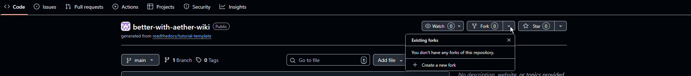

# Contribution
On this page I will quickly go over everything you need to know to contribute to this project.

## What required
This wiki is entirely written in [MarkDown](https://www.markdownguide.org/) and [HTML](). A basic understanding of both greatly help.  
This wiki is collaborative Project and as such requires you to be able to use [git]() and [github](). 
While the project does not require understanding of Programming or [Java](), we would highly recommended it. Understanding java allow you to read up on the source code. The source code can be found [here]()

## How to contribute
There are three ways you can contribute.
### Provide ready pages
Write an article on the topic of your choice. Make sure to use MarkDown  and contract us over discord.

### Edit page in Web
Go to [Aether Wiki Source Code]() on github and fork the repository.

Once the repository is forked edit any file you want. 

### Edit pages in VSCode
Setup [Vscode]() and [git]().
Repeat 

## How to reach out

## Style Guide

## Why not an actual Wiki page?

## Useful links

